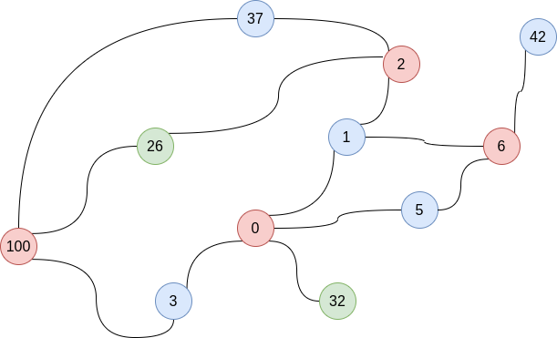

```
c++ graph_coloring.cpp <file> <chromatic>

$ c++ graph_coloring.cpp data2.csv 3
GRAPH
====================================
5(2)  : 0 6 
6(4)  : 1 5 4 2 
0(4)  : 1 5 32  3 
1(4)  : 0 2 6 32  
2(3)  : 37  1 26  
100(4)  : 37  26  3 22  
3(3)  : 0 26  100 
37(2) : 2 100 
26(3) : 100 3 2 
42(2) : 6 32  
32(4) : 100 0 1 42  

SORTED GRAPH
====================================
0(4)  : 1 5 32  3 
1(4)  : 0 2 6 32  
6(4)  : 1 5 4 2 
32(4) : 100 0 1 42  
100(4)  : 37  26  3 22  
2(3)  : 37  1 26  
3(3)  : 0 26  100 
26(3) : 100 3 2 
5(2)  : 0 6 
37(2) : 2 100 
42(2) : 6 32  

COLORIFY GRAPH
====================================
0: 0 6 100 2 
1: 1 3 5 37 42 
2: 32 26 
```


